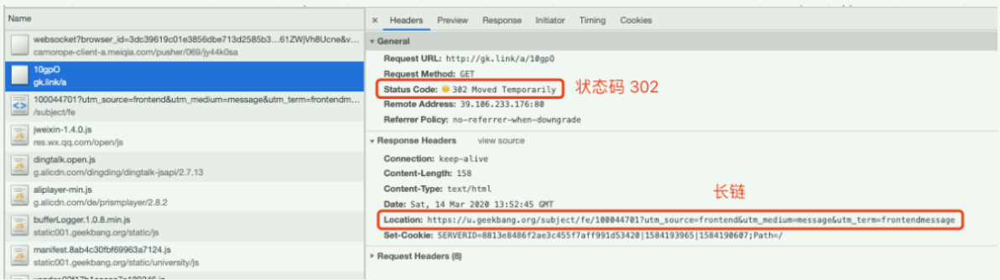
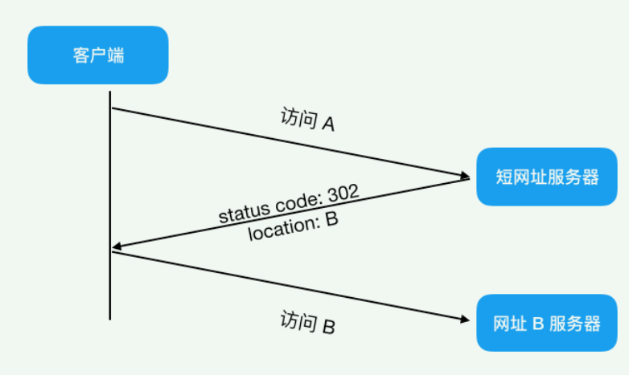
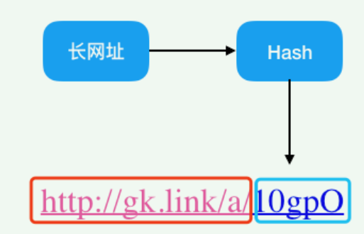
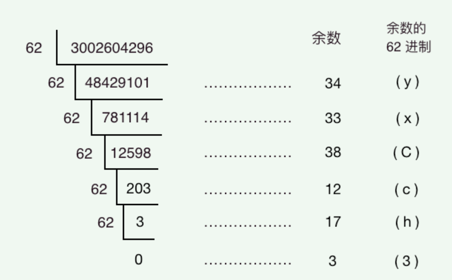
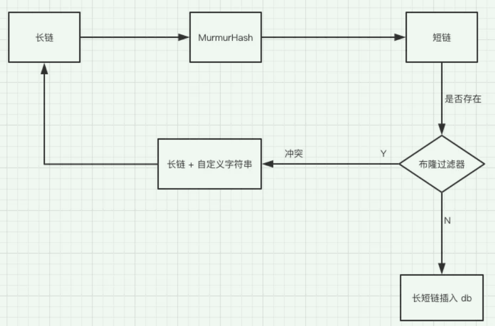

## 高性能短链系统

### 简介

本文将从以下几个方面进行探索与实现：

- 短链有什么好处
- 短链系统的基本原理
- 短链生成的几种方法
- 高性能短链的架构设计

### 短链有什么好处

1、链接变短，在对内容长度有限制的平台发文，可编辑的文字就变多了； 如微博限定字数140、短信按照发文长短收费等

2、我们经常需要将链接转成二维码的形式分享给他人，如果是长链的话二维码密集难识别，短链就不存在这个问题了。


3、 链接太长在有些平台上无法自动识别为超链接； 如钉钉，无法识别长链接，只能识别部分，用短地址则没有问题


### 短链系统的基本原理

短链好处多多，它工作原理是怎样的呢？浏览器抓包看看：



可以看到请求后，返回了状态码 302（重定向）与 location 值为长链的响应，然后浏览器会再请求这个长链以得到最终的响应,整个交互流程图如下




主要步骤就是访问短网址后重定向访问 B，那么问题来了，301 和 302 都是重定向，到底该用哪个，这里需要注意一下 301 和 302 的区别：

- 301，代表 **永久重定向**，也就是说第一次请求拿到长链接后，下次浏览器再去请求短链的话，不会向短网址服务器请求了，而是直接从浏览器的缓存里拿，这样在 server 层面就无法获取到短网址的点击数了，如果这个链接刚好是某个活动的链接，也就无法分析此活动的效果。所以我们一般不采用 301。
- **302**，代表 **临时重定向**，也就是说每次去请求短链都会去请求短网址服务器（除非响应中用 Cache-Control 或 Expired 暗示浏览器缓存）,这样就便于 server 统计点击数，所以虽然用 302 会给 server 增加一点压力，但在数据异常重要的今天，这点代码是值得的，所以推荐使用 302！

> https://blog.csdn.net/u012375924/article/details/82806617
>
>  Cache-Control : 为http中**控制缓存**开关的字段，类似的字段还有Pragma与Expires，优先级从高到低是 **Pragma -> Cache-Control -> Expires**
>
> Cache-Control：
>
> 注意：
>
> 1、符合缓存策略时，服务器不会发送新的资源，但不是说客户端和服务器就没有会话了，客户端还是会发请求到服务器的。
>
> 2、 Cache-Control除了在响应中使用，在请求中也可以使用。我们用开发者工具来模拟下请求时带上Cache-Control：勾选Disable cache，刷新页面，可以看到Request Headers中有个字段Cache-Control: no-cache


### 短链生成的几种方法

#### 1、哈希算法

怎样才能生成短链，仔细观察上例中的短链，显然它是由**固定短链域名** + **长链映射**成的一串字母组成，那么长链怎么才能映射成一串字母呢，哈希函数不就用来干这事的吗，于是我们有了以下设计思路



​		哈希函数该怎么取呢，相信肯定有很多人说用 MD5，SHA 等算法，其实这样做有点杀鸡用牛刀了，而且既然是加密就意味着性能上会有损失，我们其实**不关心反向解密的难度**，反而**更关心的是哈希的运算速度**和**冲突概率**。

> md5算法：MD5 Message-Digest Algorithm，md5信息摘要算法，是一种广泛使用的密码散列函数，可以产生16字节（128位）的散列值（hash value），用以保证信息传输的完整与一致。1996年被破解，存在弱点，对于高度安全性的数据建议使用SHA-2算法；2004年，证实MD5算法无法防止碰撞（collision），因此不适用于安全性认证，如[SSL](https://baike.baidu.com/item/SSL/320778)公开密钥认证或是[数字签名](https://baike.baidu.com/item/数字签名/212550)等用途。
>
> sha算法：Secure Hash Algorithm，一种密码散列函数标准。

​		能够满足这样的哈希算法有很多，这里推荐 Google 出品的 MurmurHash 算法，MurmurHash 是一种**非加密型**哈希函数，适用于一般的哈希检索操作。与其它流行的哈希函数相比，对于规律性较强的 key，MurmurHash 的随机分布特征表现更良好。非加密意味着着相比 MD5，SHA 这些函数它的性能肯定更高（实际上性能是 MD5 等加密算法的十倍以上），也正是由于它的这些优点，所以虽然它出现于 2008，但目前已经广泛应用到 Redis、MemCache、Cassandra、HBase、Lucene 等众多著名的软件中。

> [MurmurHash 算法](https://blog.csdn.net/qigaohua/article/details/102839111)  By. CSDN

MurmurHash 提供了两种长度的哈希值，32 bit（4字节），128 bit（16字节），为了让网址尽可通地短，我们选择 32 bit 的哈希值，32 bit 能表示的最大值近 43 亿，对于中小型公司的业务而言绰绰有余。对上文提到的极客长链做 MurmurHash 计算，得到的哈希值为 3002604296，于是我们现在得到的短链为固定短链域名+哈希值 = http://gk.link/a/3002604296

**如何缩短域名？**

这个域名还是有点长，还有一招，3002604296 得到的这个哈希值是十进制的，那我们把它转为 62 进制可缩短它的长度，10 进制转 62 进制如下：



> 画外音：6 位 62 进制数可表示 568 亿的数，应付长链转换绰绰有余
>
> 62进制：采用0-9a-zA-Z即10+26+26 = 62
>
> Base64编码：A-Za-z0-9+/  共64位 

**如何解决哈希冲突的问题？**

既然是哈希函数，不可避免地会产生哈希冲突（尽管概率很低），该怎么解决呢。

我们知道既然访问访问短链能跳转到长链，那么两者之前这种映射关系一定是要保存起来的，可以用 Redis 或 Mysql 等，这里我们选择用 Mysql 来存储。表结构应该如下所示：

```sql
CREATE TABLE `short_url_map` (
  `id` int(11) unsigned NOT NULL AUTO_INCREMENT,
  `lurl` varchar(160) DEFAULT NULL COMMENT '长地址',
  `surl` varchar(10) DEFAULT NULL COMMENT '短地址',
  `gmt_create` int(11) DEFAULT NULL COMMENT '创建时间',
  PRIMARY KEY (`id`)
) ENGINE=InnoDB DEFAULT CHARSET=utf8;
```

于是我们有了以下设计思路。

1. 将长链（lurl）经过 MurmurHash 后得到短链。
2. 再根据短链去 short_url_map 表中查找看是否存在相关记录，如果不存在，将长链与短链对应关系插入数据库中，存储。
3. 如果存在，说明已经有相关记录了，此时在长串上拼接一个自定义好的字段，比如「DUPLICATE」，然后再对接接的字段串「lurl + DUPLICATE」做第一步操作，如果最后还是重复呢，再拼一个字段串啊，只要到时根据短链取出长链的时候把这些自定义好的字符串移除即是原来的长链。

​       以上步骤显然是要优化的，插入一条记录居然要经过两次 sql 查询（根据短链查记录，将长短链对应关系插入数据库中），如果在高并发下，显然会成为瓶颈。

> *画外音：一般数据库和应用服务（只做计算不做存储）会部署在两台不同的 server 上，执行两条 sql 就需要两次网络通信，这两次网络通信与两次 sql 执行是整个短链系统的性能瓶颈所在！*

该怎么优化呢？

1. 首先我们需要给短链字段 surl 加上唯一索引（unique，直接在创建表时添加）
2. 当长链经过 MurmurHash 得到短链后，直接将长短链对应关系插入 db 中，如果 db 里不含有此短链的记录，则插入；如果包含了，**说明违反了唯一性索引**<font color='red'>（没有进行查表，直接进行插入）</font>，此时只要给长链再加上我们上文说的自定义字段「DUPLICATE」,重新 hash再插入即可，看起来在违反唯一性索引的情况下是多执行了步骤，但我们要知道 MurmurHash 发生冲突的概率是非常低的，基本上不太可能发生，所以这种方案是可以接受的。

当然如果在数据量很大的情况下，冲突的概率会增大，此时我们可以加**布隆过滤器**来进行优化。

> *画外音：布隆过滤器*是一种非常省内存的数据结构，长度为 10 亿的布隆过滤器，只需要 125 M 的内存空间。
>
> 布隆过滤器是一个数组，只有0/1两种不同情况，常用来减少无效查询，它不会查询数据库中的全部信息，只能判断数据在或不在。

综上，如果用哈希函数来设计，总体的设计思路如下：




#### 2、自增序列算法


## 参考链接

【1】 [项目最近要上一个短链接服务，忙得一腿   ](https://mp.weixin.qq.com/s/KPUuCU-q1SqnHzeyQeQzhw)  By. 微信 CodeSheep